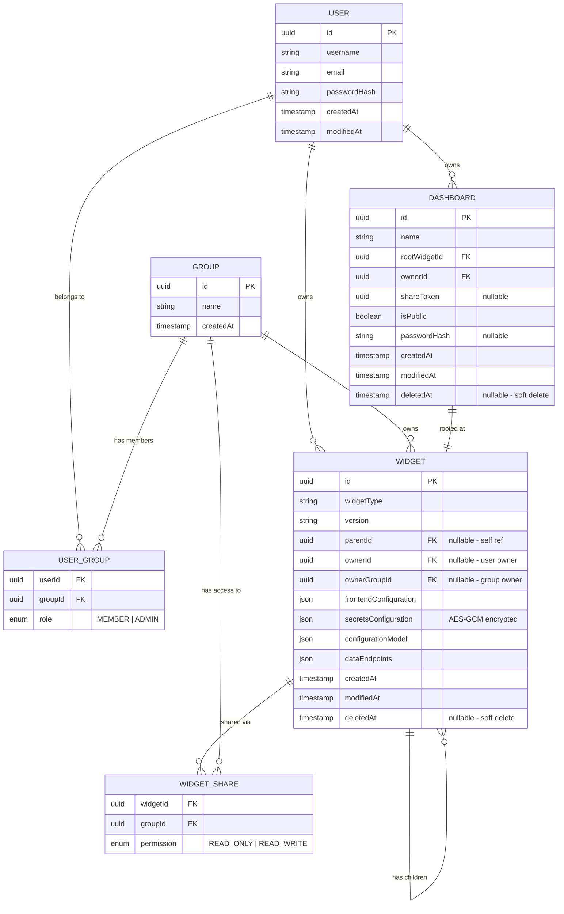
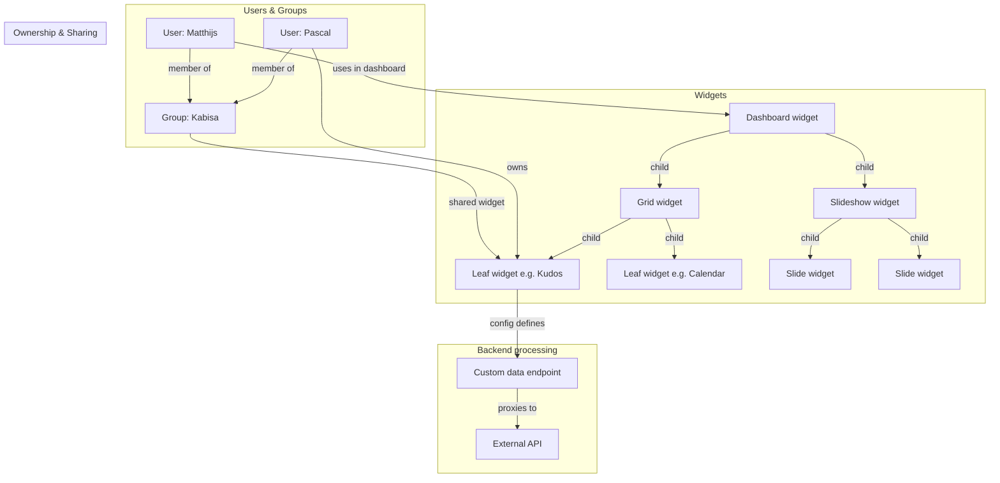

# Architecture

Explanation of the data types in this system.

# What

This application serves as an API backend for the dashboard-platform project. It is a Frontend only React application,
where widgets can be added as plugins.

To make the backend keep up with this plugin architecture, the Frontend widgets can supply a recipe how the backend should act for the data of a widget.

# Anatomy of a widget

A widget has the following characteristics:

1. A widget type
2. A unique identifier
3. (optional) Child widgets
4. A configuration format
5. Configuration values
6. A description how data for the widget is managed (if any)

## Widget type and identifier

An unique identifier for the widget type.
The identifier is a unique database key for the widget

## Child widgets

A list of Id's of childs of this widget. For instance a grid widget can have children to fill the grid cells,
or a slideshow widget has child widgets that represent each slide.

## Configuration format

This format describes the data of a widget instance, including a recipe how the backend should act as data supplier for this widget.

It tells what configuration values a widget has, what the datatype of each value is, and if a value is a secret or not.

Example:

```
{
    widgetType: "google-calendar-widget",
    configuration: {
        title: "Lunch & Learn binnenkort",
        secretIcalUrl: "https://.....",
        lookAhead: 60,
        lookBack: 0,
    },
    // Frontend settings
    configurationModel: [{
        id: "title",
        type: "string",
        scope: "frontend"
    }, {
        id: "secretIcalUrl",
        type: "string",
        scope: "backend",
    }, {
        id: "lookAhead",
        type: "integer",
        scope: "frontend"
    }, {
        id: "lookBack",
        type: "integer",
        scope: "frontend"
    }],
    // Definition of custom endpoints on backend for widget
    dataEndpoints: [{
        path: "calendar",
        cache: 600000,
        steps: [{
            action: "tunnelRequest",
            config: {
                method: "GET",
                url: "%secretIcalUrl%",
            }
        }]
    }]
}

```

## Entity relationships

The following diagram shows the intended data model for the full system.



## System architecture

Users can create personal dashboards. Each dashboard is itself a widget, and widgets can be nested into a full hierarchy using container widgets such as **grids** and **slideshows**.

- A **grid** widget defines how many slots it has; each slot is filled by a child widget.
- A **slideshow** widget defines a sequence of slides; each slide is a child widget.

Widget configuration is driven by the frontend: when a widget is added, it tells the backend what configuration fields it has and what backend processing (if any) is needed to expose a data endpoint for the frontend to retrieve its data. This configuration can include rate limits, cache settings, and references to secrets.

Users belong to one or more groups. Both users and groups can own configured widgets, which can then be shared and reused in dashboards.

**Example use case:**

1. Pascal creates a _Kudos_ widget and configures it with the credentials it needs to fetch data.
2. Pascal shares the widget with the _Kabisa_ group.
3. Matthijs, also a member of _Kabisa_, can use the pre-configured widget in his own dashboard, but cannot modify its settings (though he can see that Pascal is the owner).


